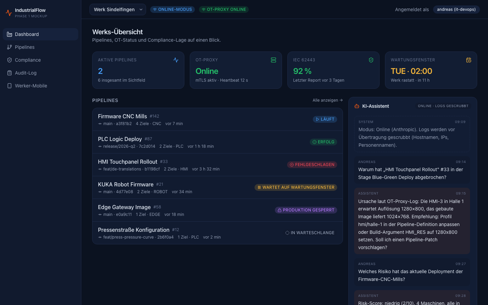

# IndustrialFlow

**CI/CD-Plattform für Industrial DevOps** — Jenkins-Kern, moderne UI, KI-Assistent, OT-native Architektur.

---

## Warum dieses Projekt existiert

Klassische CI/CD-Plattformen sind für Webanwendungen gebaut. In der Fertigung treffen sie auf eine andere Realität: SPS-Steuerungen, HMIs, CNC-Maschinen und Edge-Geräte stehen in segmentierten OT-Netzen, dürfen während laufender Produktion nicht angefasst werden und unterliegen regulatorischen Anforderungen, die weit über das hinausgehen, was Standard-Tooling abdeckt. Die Folge: Updates auf Maschinen werden manuell eingespielt, sind schlecht dokumentiert, schwer auditierbar und blockieren Innovation in genau dem Bereich, der gerade unter Druck steht — Industrie 4.5, AI on the Edge, kürzere Produktzyklen.

**IndustrialFlow schließt diese Lücke.** Die Plattform setzt auf Jenkins als bewährten Automatisierungskern — bestehende Jenkinsfiles laufen unverändert weiter — und ergänzt ihn um genau die Bausteine, die im industriellen Umfeld fehlen: Wartungsfenster und Produktionssicherheits-Locks auf Pipeline-Ebene, OPC-UA-Pre-Checks vor jedem Deployment, Blue-Green-Rollouts auf Maschinen-Flotten, einen KI-Assistenten (online über Anthropic Claude oder air-gap-fähig über Ollama), unveränderliche Audit-Logs und automatisch generierte Compliance-Reports für **IEC 62443**, **NIS2** und den **EU Cyber Resilience Act**.

Die Architektur ist von Anfang an **air-gap-fähig**: keine erzwungene Cloud-Abhängigkeit, alle Komponenten laufen offline, optionaler Online-Modus nur wo explizit aktiviert. Damit ist IndustrialFlow für genau die Werke gebaut, in denen klassische SaaS-CI/CD-Lösungen aus regulatorischen oder netztechnischen Gründen ausscheiden.

**Geschäftlicher Nutzen für die IT-Leitung:**

- **Compliance-Vorbereitung statt Compliance-Brand.** SBOMs, signierte Builds und ein revisionssicherer Audit-Log sind eingebaut, nicht nachträglich aufgesetzt. NIS2-Registrierungsfrist (6.3.2026) und CRA-SBOM-Pflicht (11.9.2026) sind im Datenmodell vorgesehen.
- **Reduktion von Stillstandsrisiken.** Production-Locks und automatisierte Pre-Deploy-Checks verhindern Deployments in einen laufenden Produktionszustand.
- **Wissenstransfer.** Der integrierte KI-Assistent analysiert Build-Failures, schlägt Pipeline-Verbesserungen vor und liefert Risk-Scores — auch im Air-Gap-Modus, ohne dass Werksdaten den Perimeter verlassen.
- **Investitionsschutz.** Jenkins bleibt der Kern. Bestehende Pipelines, Skills und Plugin-Ökosystem bleiben erhalten.

---



*Werks-Übersicht mit aktiven Pipelines, OT-Proxy-Status, Compliance-Stand und KI-Assistent-Panel.*

---

## Phasen-Plan

Das Repository wächst in sechs Phasen vom klickbaren Frontend-Mockup zur vollständigen Plattform:

| Phase | Inhalt | Status |
|-------|--------|--------|
| **1** | GUI-Mockup mit Mock-Daten (Next.js, Dashboard, Pipeline-Detail, Werker-Mobile, Compliance, Audit) | **aktuell** |
| 2 | Jenkins-Backend-Integration via Backend-for-Frontend (Fastify, Postgres, JCasC) | geplant |
| 3 | KI-Assistent (Anthropic Claude online / Ollama air-gap), Build-Failure-Analyse, Pipeline-Generator | geplant |
| 4 | OT-Layer (Go-basierter OT-Proxy-Agent, OPC-UA-Bridge, Wartungsfenster, Production-Locks) | geplant |
| 5 | DevSecOps & Compliance (SBOM via CycloneDX/SPDX, Trivy, Semgrep, OPA/Rego, signierte Reports) | geplant |
| 6 | Multi-Site & Air-Gap (Harbor-Registry-Mirror, Plugin-Mirror, Multi-Site-Controller) | geplant |

---

## Aktuelle Phase: Phase 1 — GUI-Mockup

Vollständig durchklickbares Next.js-Frontend mit allen wesentlichen Screens. Stakeholder können das Bedienkonzept validieren, ohne dass Jenkins, KI-APIs oder OT-Hardware angebunden sind. Daten kommen aus `packages/mock-data` und werden über eine `PipelineProvider`-Schnittstelle bereitgestellt, die in Phase 2 1:1 vom BFF-Provider implementiert wird — die UI bleibt unverändert.

### Routen

- `/dashboard` — Werks-Übersicht mit Kennzahlen-Karten, Pipeline-Liste, KI-Assistent-Panel
- `/pipelines` — Pipeline-Liste mit Filter und Sortierung
- `/pipelines/[id]` — Pipeline-Detail mit IT/OT-Stage-Flow und Deployment-Matrix
- `/compliance` — Reports nach IEC 62443, NIS2, TISAX-Vorbereitung, Cyber Resilience Act
- `/audit` — Tabellarischer Audit-Log
- `/m` — Mobile Werker-Ansicht (Freigaben, Maschinen-Status, Wartungsfenster)
- `/login` — Mock-Login (Default-User „andreas")

---

## Tech-Stack (Phase 1)

- **Next.js 15** mit App Router
- **TypeScript** im strict mode
- **Tailwind CSS v4** und **shadcn/ui**
- **lucide-react** für Icons, **Recharts** für Compliance-Diagramme
- **Vitest** + React Testing Library
- **pnpm** als Paketmanager (Workspace mit `apps/*`, `packages/*`, `services/*`)
- **Docker** (Multi-Stage, Next.js standalone) und **Caddy** als TLS-Reverse-Proxy
- **GitHub Actions** als CI/CD, **GitHub Container Registry** als Image-Registry

---

## Schnellstart

### Voraussetzungen

- Node.js ≥ 20
- pnpm 10

### Lokale Entwicklung

```bash
pnpm install        # Workspace-Dependencies
pnpm dev            # Next.js Dev-Server auf http://localhost:3000
pnpm typecheck      # tsc --noEmit über alle Packages
pnpm lint           # ESLint
pnpm test           # Vitest
pnpm build          # Production-Build
```

### Produktions-Build im Container

```bash
docker build -t industrialflow-web .
docker compose -f infra/docker-compose.prod.yml up -d
```

---

## Projektstruktur

```
industrialflow/
├── .github/workflows/    # CI/CD: Quality-Gate → Image-Build → SSH-Deploy
├── apps/
│   ├── web/              # Next.js-Frontend (Phase 1+)
│   └── bff/              # Backend-for-Frontend (Phase 2+)
├── packages/
│   ├── types/            # Geteilte TypeScript-Typen
│   └── mock-data/        # Mock-Provider für Phase 1
├── services/
│   ├── ot-proxy/         # OT-Proxy-Agent in Go (Phase 4+)
│   └── opcua-bridge/     # OPC-UA-Bridge (Phase 4+)
├── infra/
│   ├── docker-compose.prod.yml
│   ├── caddy/            # TLS + Let's Encrypt
│   ├── jcasc/            # Jenkins Configuration as Code (Phase 2+)
│   └── policies/         # OPA-Rego-Policies (Phase 5+)
├── docs/                 # Architektur- und Compliance-Dokumentation
└── CLAUDE.md             # Detaillierter Phasen- und Architekturplan
```

---

## Deployment

Die Plattform läuft auf einer VM hinter Caddy mit automatischem Let's Encrypt. Die öffentliche Phase-1-Demo ist erreichbar unter **[industrial-flow.comquent.academy](https://industrial-flow.comquent.academy)**.

Jeder Push auf `main` durchläuft Quality-Gate (Typecheck + Tests), Image-Build mit BuildKit-Cache, Push zu GHCR, SSH-Deploy auf die Ziel-VM und einen Smoke-Test gegen den Dashboard-Endpunkt.

---

## Architekturprinzipien (nicht verhandelbar)

- **Jenkins ist Kern, nicht Ersatz.** Bestehende Jenkinsfiles laufen ohne Änderung.
- **Air-Gap-Fähigkeit ist Default.** Externe Aufrufe nur, wenn explizit aktiviert.
- **Compliance ist eingebaut, nicht aufgesetzt.** Das Datenmodell trägt ab Phase 1 die Felder für SBOMs, Audit-Log und Compliance-Reports.
- **UI-Sprache Deutsch, Code-Sprache Englisch.** Keine Mischformen.

Details, Datenmodelle und Phasen-Spezifikationen siehe [CLAUDE.md](CLAUDE.md).

---

## Über Comquent

IndustrialFlow ist ein Projekt der **Comquent GmbH** — Spezialist für DevOps, Test-Automatisierung und Software-Qualität im industriellen Umfeld.

- Hintergrund-Artikel zur Architektur: [comquent.de/ressourcen/blog/industrialflow-cicd-plattform-industrial-devops](https://comquent.de/ressourcen/blog/industrialflow-cicd-plattform-industrial-devops)
- Unternehmens-Website: [comquent.de](https://comquent.de)
- Trainings und Weiterbildung: [comquent.academy](https://comquent.academy)
